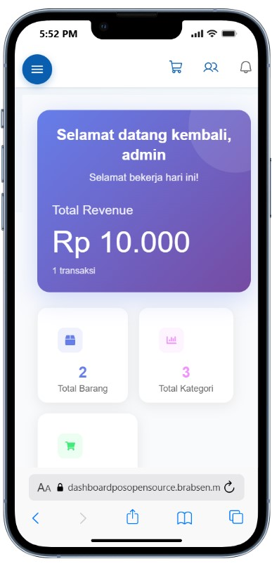
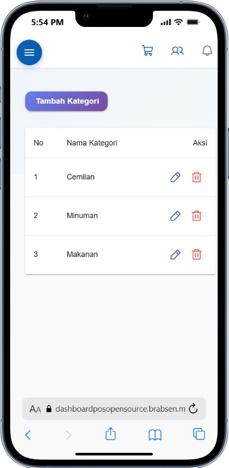
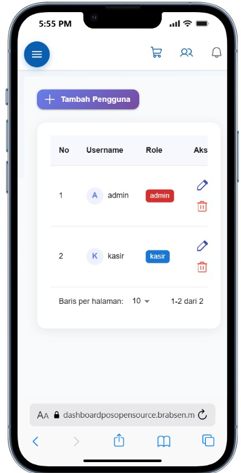
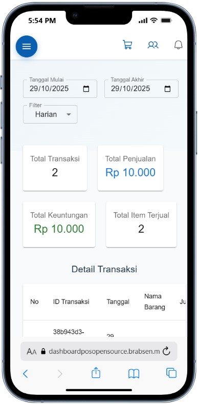
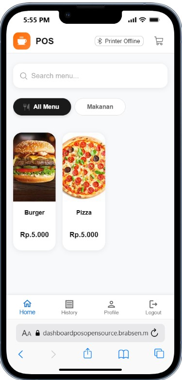
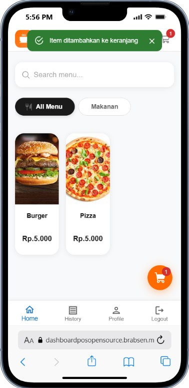
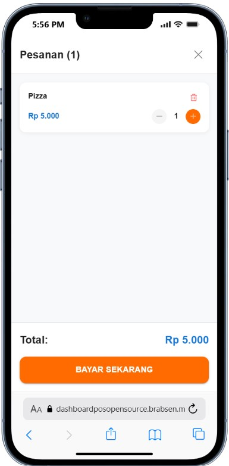
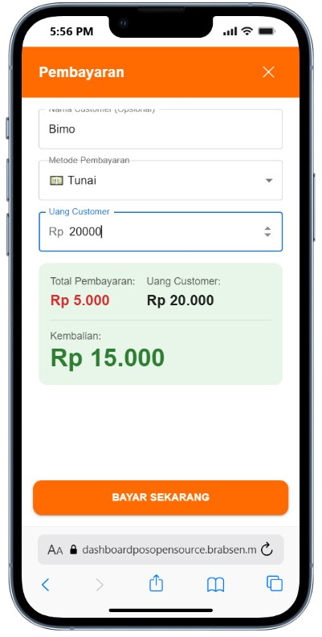

#  Aplikasi Kasir Modern

> Sistem Point of Sale (POS) berbasis web yang dibangun dengan React + Vite untuk manajemen penjualan yang efisien dan modern.

[](https://reactjs.org/)
[](https://vitejs.dev/)
[](LICENSE)

## Backend(express.js) https://github.com/bimowahyu/BackendPOS.git
##  Fitur Utama

### Dashboard Admin
-  **Dashboard Admin** - Visualisasi data penjualan dan statistik real-time
-  **Manajemen Barang** - CRUD barang dengan kategori lengkap
-  **Manajemen Kategori** - Organisasi produk yang terstruktur
-  **Manajemen User** - Kontrol akses pengguna dan kasir
-  **Laporan Transaksi** - Riwayat dan detail transaksi lengkap

###  Dashboard Kasir
- **Dashboard Kasir** - Interface intuitif untuk penjualan cepat
- **Keranjang Belanja** - Tambah, edit, dan hapus item dengan mudah
- **Proses Pembayaran** - Sistem pembayaran yang simpel dan cepat
- **Cetak Struk** - Generate invoice otomatis

##  Screenshot

### Admin Dashboard

<table>
  <tr>
    <td></td>
    <td></td>
  </tr>
  <tr>
    <td align="center"><b>Dashboard Admin</b></td>
    <td align="center"><b>Manajemen Barang</b></td>
  </tr>
  <tr>
    <td></td>
    <td></td>
  </tr>
  <tr>
    <td align="center"><b>Manajemen Kategori</b></td>
    <td align="center"><b>Manajemen User</b></td>
  </tr>
  <tr>
    <td colspan="2"></td>
  </tr>
  <tr>
    <td align="center" colspan="2"><b>Laporan Transaksi</b></td>
  </tr>
</table>

### Kasir Dashboard

<table>
  <tr>
    <td></td>
    <td></td>
  </tr>
  <tr>
    <td align="center"><b>Dashboard Kasir</b></td>
    <td align="center"><b>Tambah ke Keranjang</b></td>
  </tr>
  <tr>
    <td></td>
    <td></td>
  </tr>
  <tr>
    <td align="center"><b>Keranjang Belanja</b></td>
    <td align="center"><b>Proses Pembayaran</b></td>
  </tr>
</table>

##  Quick Start

### Prerequisites

- Node.js 18+ 
- npm atau yarn

### Instalasi

```bash
# Clone repository
git clone https://github.com/bimowahyu/kasirFrontendweb.git

# Masuk ke direktori project
cd kasirFrontendweb

# Install dependencies
npm install

# Salin file environment
cp .env.example .env

# Jalankan development server
npm run dev
```

### Build Production

```bash
# Build untuk production
npm run build

# Preview build
npm run preview
```

##  Tech Stack

- **Framework:** React 18+
- **Build Tool:** Vite 5+
- **Language:** JavaScript (ES6+)
- **Linting:** ESLint dengan React Compiler
- **Styling:** CSS Modules / Tailwind CSS
- **State Management:** React Hooks

## Konfigurasi

### Environment Variables

Buat file `.env` di root directory:

```env
VITE_API_URL=http://localhost:3000/api
VITE_APP_NAME=Aplikasi Kasir
```

### Vite Plugins

Project ini menggunakan:

- **@vitejs/plugin-react** - Fast Refresh dengan Babel
- **@vitejs/plugin-react-swc** - Fast Refresh dengan SWC (alternatif)

Pilih salah satu plugin di `vite.config.js` sesuai kebutuhan.

##  Scripts

```json
{
  "dev": "Jalankan development server",
  "build": "Build untuk production",
  "preview": "Preview production build",
  "lint": "Cek kode dengan ESLint"
}
```

##  React Compiler

Template ini sudah mengaktifkan **React Compiler** untuk optimasi performa. Lihat [dokumentasi resmi](https://react.dev/learn/react-compiler) untuk detail lebih lanjut.

>  **Catatan:** React Compiler akan mempengaruhi performa dev & build Vite.

## Extending ESLint

Untuk aplikasi production dengan TypeScript:

1. Gunakan [TS template](https://github.com/vitejs/vite/tree/main/packages/create-vite/template-react-ts)
2. Integrasikan [`typescript-eslint`](https://typescript-eslint.io)
3. Enable type-aware lint rules


##  License

Distributed under the MIT License. See `LICENSE` for more information.

##  Tim

- **Developer** - [Your Name](https://github.com/yourusername)

## Acknowledgments

- [React](https://reactjs.org/)
- [Vite](https://vitejs.dev/)
- [React Icons](https://react-icons.github.io/react-icons/)

---

<div align="center">
  Made with ❤️ by <a href="https://github.com/bimowahyu">Bimo Wahyu</a>
</div>